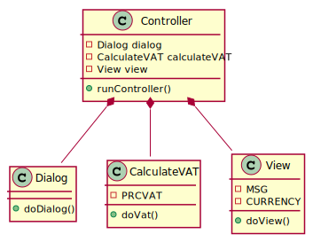

## Opgave 1 : Hundekennel.
1) I main skal man lave et hundeobjekt med navn og ejer
2) Skriv en klasse, Dog med en boolean attribut - isHungry - som skal initialiseres til true.
   
   Lav en metode - feedDog - som tager hensyn til om hunden er sulten.
   
   Husk at sætte isHungry til false, når den er blevet fodret.
3) Modificér hunde-klassen så den kan få hvalpe. Dvs indfør en attribut a la:
   
   private ArrayList<String> offSpring;
   
   Konstruktøren skal initialisere offSpring.
4) Tilføj nu en getter og en setter. Setter-metoden skal sørge for at fylde
   offSpring til Dog klassen.
5) Modificer  Dog klassen så ejeren ikke længere er type String men typen Owner
   (som altså er en klasse der skal laves fra bunden). Dvs flg skal skiftes:
   
   private String ejer;
   
   så det bliver til:
   
   private Owner ejer;
   
   Når det er ændret vil man også skulle ændre i getter og setter samt i main.
   Flg skal kunne virke fra main:
   System.out.println("hunden " + getDogName() + " er ejet af " + myDog.getOwner());
6) Gør det samme for offSpring. Dvs
   
   private ArrayList<String> offSpring; bliver til
   
   private ArrayList <Dog> offSpring;
7) Lav en metode der kan printe navnene på en hund's hvalpe.
## Opgave 2 : ComputeVATBetterStyleOO.
Skriv et program om så det bliver objektorienteret. Dokumenter med et klassediagram i UML
1) Kør koden så du forstår hvad den gør
2) Kopier eksisterende kode
3) Gem hver metode i en klasse med passende navne
   
   - doDiag i en klasse der hedder 'Dialog'
   
   - doVat i en klasse der hedder 'CalculateVat'
   
   - doView i en klasse der hedder 'View'
   
   - runController i en klasse der hedder 'Controller'
4) Sørg for passende "inventar" (fields, constructor og metoder)
5) Sørg for at lave en Main som kun rummer flg:

<pre>
public static void main(String[] args) {
    Controller controller = new Controller();
    controller.runController();
}
</pre>
TEST kørsel:

<samp>

Indtast varens pris:

***345.6***

Du betaler 86.40 Kr i MOMS

</samp>

6) Dokumenter programmet med et klassediagram - brug PlantUML

